<div align="center">

# 🚀 ForgeAI

### Enterprise Multi-Agent Software Engineering Platform

**Transform software ideas into production-ready engineering artifacts through an AI-powered multi-agent software engineering pipeline.**

<p align="center">


</p>

> **A modern AI platform that orchestrates multiple specialized agents to automate the Software Development Lifecycle (SDLC).**

---

### 🌐 Live Application

| Service | Link |
|---------|------|
| 🚀 Frontend | https://YOUR-VERCEL-URL |
| ⚙ Backend API | https://YOUR-RENDER-URL |
| 📚 Swagger Docs | https://YOUR-RENDER-URL/docs |

---

</div>

# 📖 Overview

Software engineering begins long before developers write the first line of code. Gathering requirements, designing architectures, planning development tasks, modeling databases, reviewing outputs, and preparing technical documentation require significant manual effort.

ForgeAI automates these early software engineering activities through a collaborative **Multi-Agent AI Pipeline**.

Instead of relying on a single Large Language Model response, ForgeAI coordinates multiple specialized AI agents where each agent focuses on a dedicated engineering responsibility. The generated output from one agent becomes contextual input for the next, producing consistent and structured software engineering artifacts from a single natural language project description.

The platform demonstrates how modern AI systems can be integrated with enterprise software engineering principles using **FastAPI**, **React**, **TypeScript**, **PostgreSQL**, **Clean Architecture**, and **cloud-native deployment**.

---

# 🎯 Problem Statement

Traditional AI assistants can generate code, but they rarely follow the structured engineering workflow required for real-world software development.

Developers still need to manually perform tasks such as:

- Requirement analysis
- System architecture design
- Database modeling
- Task planning
- Backend planning
- Frontend planning
- Documentation
- Review and refinement

These steps are repetitive, time-consuming, and often inconsistent across projects.

---

# 💡 Solution

ForgeAI introduces an **AI-driven Multi-Agent Software Engineering Platform** where independent AI agents collaborate to automate the Software Development Lifecycle.

Starting from a simple project description, ForgeAI generates organized engineering artifacts covering:

- Software Requirements
- System Architecture
- Task Breakdown
- Database Design
- Backend Planning
- Frontend Planning
- Review Reports
- Refined Documentation
- Downloadable Project Artifacts

---

# ✨ Why ForgeAI?

ForgeAI is designed to showcase how AI orchestration can be combined with enterprise software engineering practices.

Unlike traditional single-prompt AI applications, ForgeAI follows a modular pipeline where every stage has a clearly defined responsibility.

This approach provides:

- 🤖 AI Agent Orchestration
- 🏗 Enterprise Clean Architecture
- 📑 Structured Documentation Generation
- ⚡ Fully Asynchronous Backend
- 🔐 Secure Authentication
- 🗄 PostgreSQL Persistence
- 📦 Artifact Packaging
- 🌐 Production Deployment
- 🐳 Dockerized Infrastructure
- 🔄 Extensible AI Pipeline

---

# ⭐ Key Highlights

| Feature | Description |
|----------|-------------|
| 🤖 Multi-Agent AI | Nine specialized AI agents collaborate throughout the SDLC |
| ⚡ FastAPI Backend | High-performance asynchronous REST API |
| 🎨 Modern Frontend | React + TypeScript + TailwindCSS |
| 🔐 Authentication | JWT Access & Refresh Token authentication |
| 🗄 Database | PostgreSQL hosted on Neon |
| ☁ Cloud Deployment | Render + Vercel |
| 📄 Artifact Management | Preview, download and ZIP packaging |
| 🏗 Clean Architecture | Presentation, Application, Domain and Infrastructure layers |
| 🐳 Docker | Production-ready containerization |
| 📚 Swagger API | Interactive API documentation |

---

# 📑 Table of Contents

- Overview
- Problem Statement
- Solution
- AI Multi-Agent Pipeline
- Features
- Tech Stack
- Architecture
- Project Structure
- Screenshots
- Installation
- Environment Variables
- Docker
- Deployment
- API Overview
- Roadmap
- Contributing
- License
- Author

---

# 🤖 AI Multi-Agent Pipeline

ForgeAI is built around a collaborative **Multi-Agent AI architecture** that decomposes software engineering into specialized responsibilities. Rather than relying on a single prompt or monolithic AI response, the platform coordinates multiple AI agents, each dedicated to a specific phase of the Software Development Lifecycle (SDLC).

Every agent consumes structured outputs from the previous stage, enriches the project with domain-specific knowledge, and passes its results to the next agent. This sequential orchestration improves consistency, modularity, and the overall quality of generated engineering artifacts.

---

## 🔄 Pipeline Workflow

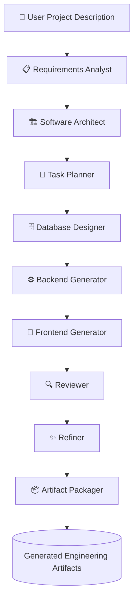

---

# 📚 AI Agent Responsibilities

| Agent | Primary Responsibility | Output |
|--------|------------------------|--------|
| 📋 Requirements Analyst | Extracts and structures functional & non-functional requirements from the user prompt. | Software Requirements Specification (SRS) |
| 🏗️ Software Architect | Designs the overall application architecture, modules, and component interactions. | High-Level Architecture Document |
| 📅 Task Planner | Breaks the project into manageable milestones, epics, and implementation tasks. | Development Roadmap |
| 🗄️ Database Designer | Designs entities, relationships, schema, and normalization strategy. | Database Design Document |
| ⚙️ Backend Generator | Plans APIs, services, authentication, business logic, and backend architecture. | Backend Design Document |
| 🎨 Frontend Generator | Designs pages, layouts, components, UI flow, and frontend architecture. | Frontend Design Document |
| 🔍 Reviewer | Reviews generated artifacts for consistency, completeness, and engineering quality. | Review Report |
| ✨ Refiner | Improves documentation by resolving inconsistencies and refining outputs. | Refined Documentation |
| 📦 Artifact Packager | Collects, organizes, and prepares all generated artifacts for preview and download. | ZIP Archive & Individual Documents |

---

# ⚙️ Pipeline Execution Lifecycle

The pipeline executes sequentially to preserve engineering context throughout the workflow.

1. The user submits a software project idea.
2. ForgeAI creates a new project and execution run.
3. The Requirements Analyst extracts project requirements.
4. The Software Architect designs the system architecture.
5. The Task Planner creates implementation milestones.
6. The Database Designer generates the database schema.
7. The Backend Generator produces backend planning artifacts.
8. The Frontend Generator creates frontend design artifacts.
9. The Reviewer validates generated outputs.
10. The Refiner enhances documentation quality.
11. The Artifact Packager bundles all generated files.
12. Users preview or download individual artifacts or a ZIP package.

---

# 🎯 Why a Multi-Agent Approach?

Unlike single-prompt AI systems, ForgeAI distributes responsibilities across multiple specialized agents.

This architecture provides several advantages:

- 🧩 Separation of engineering responsibilities
- 📈 Improved consistency between generated artifacts
- 🔄 Better context propagation across SDLC phases
- 📦 Modular and extensible pipeline design
- 🛠️ Easier maintenance and future expansion
- ⚡ Scalable orchestration for additional AI agents

By modeling the software development lifecycle as a sequence of collaborative AI agents, ForgeAI demonstrates a practical approach to AI-assisted software engineering rather than simple code generation.

---

# ✨ Features

ForgeAI combines modern AI capabilities with enterprise software engineering practices to automate the planning and documentation phases of software development.

---

## 🤖 AI Capabilities

- Multi-Agent AI Orchestration
- AI-powered Software Requirements Analysis
- Automated System Architecture Generation
- Intelligent Task Planning
- Database Schema Design
- Backend Planning & API Design
- Frontend Planning & UI Structure
- Automated Artifact Review
- Documentation Refinement
- Engineering Artifact Packaging

---

## 💻 Frontend

- React 19
- TypeScript
- Vite
- TailwindCSS
- Zustand State Management
- Axios API Client
- Responsive Dashboard
- Authentication Pages
- Project Management Interface
- Artifact Preview
- Download Manager

---

## ⚙ Backend

- FastAPI
- Async SQLAlchemy
- Pydantic v2
- Alembic Migrations
- PostgreSQL Integration
- Clean Architecture
- Repository Pattern
- Dependency Injection
- Modular Services
- Background Task Execution

---

## 🔐 Security

- JWT Authentication
- Refresh Tokens
- Password Hashing
- Protected Routes
- Role-Based Authorization
- Secure API Configuration
- Environment Variable Management

---

## 📦 Artifact Management

- Preview Generated Artifacts
- Download Individual Files
- Download Complete ZIP Package
- Persistent Artifact Storage
- Run History
- Project History

---

## ☁ Deployment

- Dockerized Backend
- Render Deployment
- Vercel Frontend
- Neon PostgreSQL
- Automatic Database Migration
- Production Configuration
- HTTPS Ready

---

# 🛠 Tech Stack

## Frontend

| Technology | Purpose |
|------------|---------|
| React | User Interface |
| TypeScript | Type Safety |
| Vite | Build Tool |
| TailwindCSS | Styling |
| Zustand | State Management |
| Axios | API Communication |

---

## Backend

| Technology | Purpose |
|------------|---------|
| FastAPI | REST API |
| SQLAlchemy Async | ORM |
| Pydantic v2 | Data Validation |
| Alembic | Database Migration |
| AsyncPG | PostgreSQL Driver |

---

## Database

| Technology | Purpose |
|------------|---------|
| PostgreSQL | Relational Database |
| Neon | Managed Cloud Database |

---

## AI

| Technology | Purpose |
|------------|---------|
| Grok API | LLM Inference |
| Multi-Agent Pipeline | Software Engineering Automation |

---

## DevOps

| Technology | Purpose |
|------------|---------|
| Docker | Containerization |
| Render | Backend Hosting |
| Vercel | Frontend Hosting |
| GitHub | Version Control |

---

# 🏗 System Architecture

ForgeAI follows **Clean Architecture** principles to maintain separation of concerns, scalability, and maintainability.

## High-Level Architecture

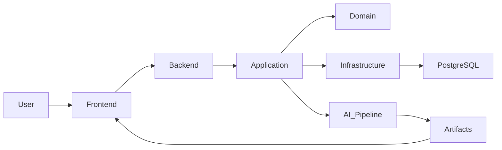

---

## Clean Architecture

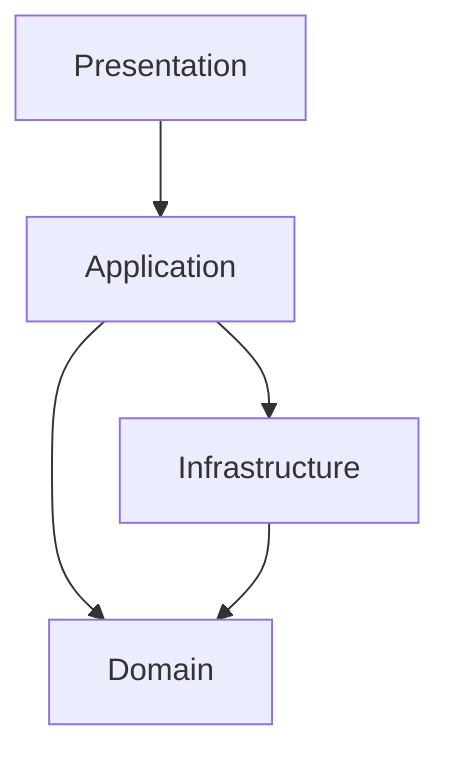

---

## Request Lifecycle

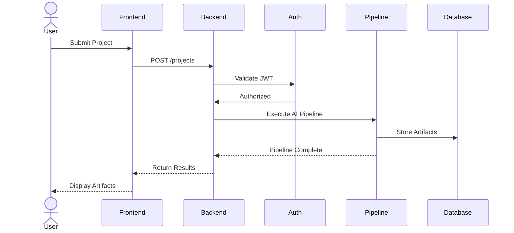

---

# 📂 Project Structure

```text
ForgeAI
│
├── backend
│   ├── alembic
│   ├── app
│   │   ├── application
│   │   ├── domain
│   │   ├── infrastructure
│   │   ├── presentation
│   │   └── main.py
│   ├── Dockerfile
│   └── pyproject.toml
│
├── frontend
│   ├── public
│   ├── src
│   │   ├── app
│   │   ├── components
│   │   ├── features
│   │   ├── pages
│   │   ├── shared
│   │   └── main.tsx
│   └── vite.config.ts
│
├── docs
│   ├── diagrams
│   ├── gifs
│   └── images
│
├── scripts
│
├── README.md
│
└── LICENSE
```

---

## 🏛 Design Principles

ForgeAI was designed around modern enterprise software engineering principles:

- Clean Architecture
- Separation of Concerns
- SOLID Principles
- Repository Pattern
- Dependency Injection
- Modular AI Pipeline
- Asynchronous Processing
- Cloud-Native Deployment
- Secure Authentication
- Scalable Project Organization

---

# 📸 Application Screenshots

The following screenshots showcase the major workflows and user interface of ForgeAI.

> **Note:** Replace these placeholders with your actual screenshots located in the `docs/images/` directory.

---

## 🔐 Login

<p align="center">
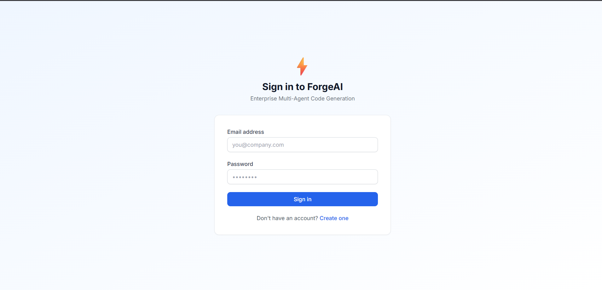
</p>

---

## 📝 Register

<p align="center">
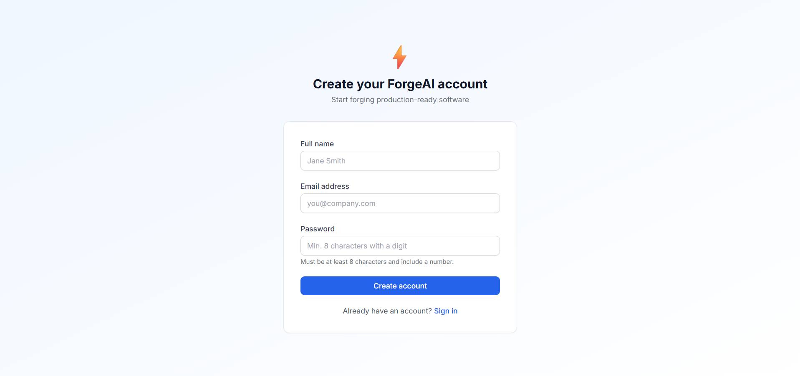
</p>

---

## 📊 Dashboard

<p align="center">
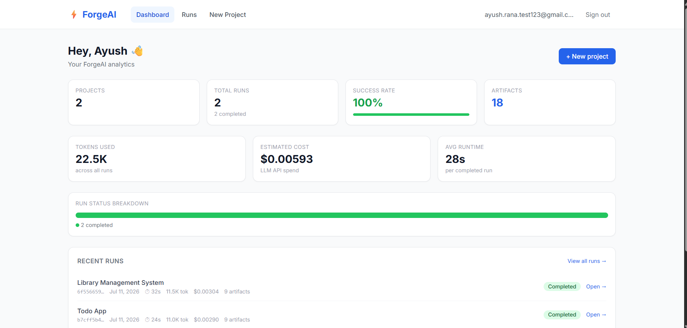
</p>

---

## 🚀 Create Project

<p align="center">
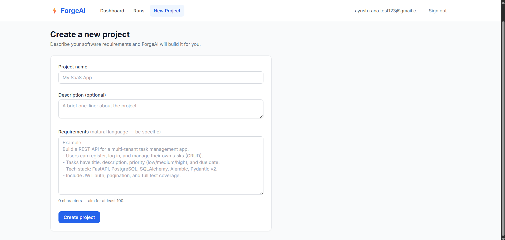
</p>

---

## 🤖 AI Pipeline Execution

<p align="center">
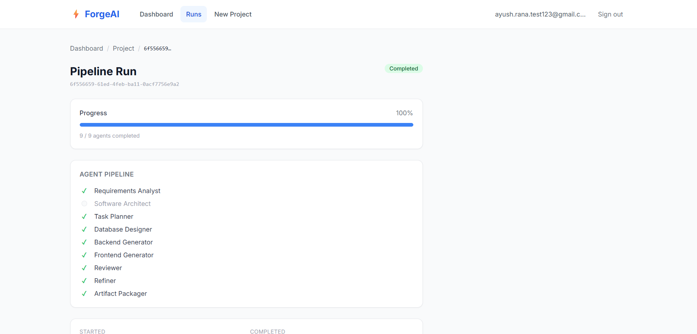
</p>

---

## 📄 Generated Artifacts

<p align="center">
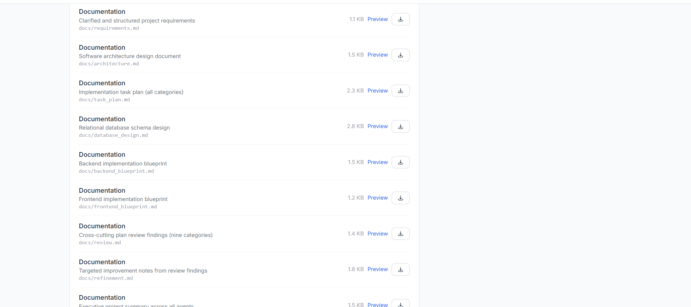
</p>

---

## 👀 Artifact Preview

<p align="center">
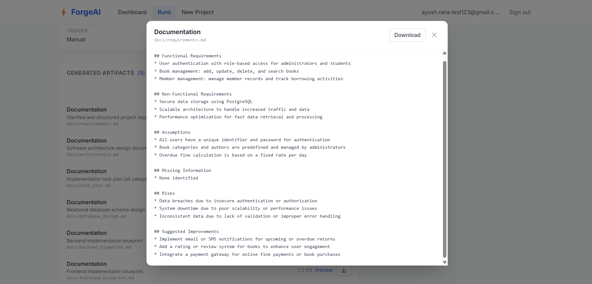
</p>

---

# ⚙️ Local Development Setup

## Prerequisites

Before running ForgeAI locally, ensure the following software is installed.

| Software | Version |
|----------|----------|
| Python | 3.12+ |
| Node.js | 20+ |
| npm | Latest |
| PostgreSQL | 16+ (or Neon) |
| Docker | Latest |
| Git | Latest |

---

# 📥 Clone Repository

```bash
git clone https://github.com/YOUR_USERNAME/ForgeAI.git

cd ForgeAI
```

---

# ⚙️ Backend Setup

Navigate to the backend directory.

```bash
cd backend
```

Create a virtual environment.

```bash
python -m venv .venv
```

### Windows

```bash
.venv\Scripts\activate
```

### Linux / macOS

```bash
source .venv/bin/activate
```

Install dependencies.

```bash
pip install -e .
```

Run database migrations.

```bash
alembic upgrade head
```

Start the backend server.

```bash
uvicorn app.main:app --reload
```

Backend URL

```
http://localhost:8000
```

Swagger Documentation

```
http://localhost:8000/docs
```

---

# 🎨 Frontend Setup

Navigate to the frontend directory.

```bash
cd frontend
```

Install dependencies.

```bash
npm install
```

Start the development server.

```bash
npm run dev
```

Frontend URL

```
http://localhost:5173
```

---

# 🔑 Environment Variables

## Backend

Create a `.env` file inside the `backend` directory.

```env
DATABASE_URL=

JWT_SECRET_KEY=

JWT_REFRESH_SECRET_KEY=

ACCESS_TOKEN_EXPIRE_MINUTES=

REFRESH_TOKEN_EXPIRE_DAYS=

GROK_API_KEY=

GROK_BASE_URL=

GROK_MODEL=
```

---

## Frontend

Create a `.env` file inside the `frontend` directory.

```env
VITE_API_BASE_URL=
```

---

# 🐳 Docker

Build the Docker image.

```bash
docker build -t forgeai-backend .
```

Run the Docker container.

```bash
docker run -p 8000:8000 forgeai-backend
```

During container startup, ForgeAI automatically executes:

```bash
python -m alembic upgrade head
```

before launching the FastAPI application to ensure the database schema is always up to date.

---

# ☁️ Deployment

ForgeAI is deployed using a cloud-native architecture.

| Component | Platform |
|-----------|----------|
| Frontend | Vercel |
| Backend | Render |
| Database | Neon PostgreSQL |
| AI Provider | Grok API |

---

## Deployment Highlights

- Dockerized FastAPI Backend
- Automatic Alembic Database Migration
- Async PostgreSQL Connectivity
- HTTPS Enabled
- Secure JWT Authentication
- Production Environment Configuration
- Cloud-native Deployment

---

# 📚 API Overview

ForgeAI exposes RESTful APIs for authentication, project management, pipeline execution, and artifact handling.

| Module | Description |
|---------|-------------|
| Authentication | Login, Registration, Refresh Tokens |
| Projects | Create and Manage Projects |
| Pipeline | Execute Multi-Agent Workflow |
| Runs | Monitor Pipeline Execution |
| Artifacts | Preview and Download Generated Files |

Interactive API documentation is available at:

```text
/docs
```

---

# 🗺️ Roadmap

ForgeAI is designed to be an extensible AI software engineering platform. The following enhancements are planned for future releases.

## Version 1.1

- [ ] Streaming AI responses
- [ ] Parallel agent execution
- [ ] Improved execution monitoring
- [ ] Enhanced error reporting
- [ ] Better artifact formatting

---

## Version 1.2

- [ ] GitHub repository generation
- [ ] Automatic README generation
- [ ] UML diagram generation
- [ ] Sequence diagram generation
- [ ] Architecture diagram export

---

## Version 2.0

- [ ] Multi-LLM support (OpenAI, Claude, Gemini, Grok)
- [ ] RAG-powered project context
- [ ] Agent memory
- [ ] Team collaboration
- [ ] Project versioning
- [ ] CI/CD workflow generation
- [ ] Infrastructure as Code generation
- [ ] Plugin ecosystem

---

# 🤝 Contributing

Contributions are welcome!

If you would like to improve ForgeAI:

1. Fork the repository.
2. Create a feature branch.

```bash
git checkout -b feature/my-feature
```

3. Commit your changes.

```bash
git commit -m "feat: add my feature"
```

4. Push your branch.

```bash
git push origin feature/my-feature
```

5. Open a Pull Request.

Please ensure that your code follows the existing project structure and coding conventions.

---

# 📄 License

This project is licensed under the **MIT License**.

See the `LICENSE` file for more information.

---

# 👨‍💻 Author

## Ayush Rana

**B.Tech Computer Science & Engineering (Cyber Physical Systems)**  
Vellore Institute of Technology, Chennai

### Connect with me

- GitHub: https://github.com/Ayushrana1704
- LinkedIn: https://www.linkedin.com/in/ayush-rana132321/

---

# 🙏 Acknowledgements

ForgeAI was developed as a final-year engineering project to explore how modern AI systems can automate structured software engineering workflows through collaborative multi-agent orchestration.

Special thanks to the open-source communities behind:

- FastAPI
- React
- SQLAlchemy
- PostgreSQL
- Vite
- TailwindCSS
- Docker

whose tools and ecosystems made this project possible.

---

<div align="center">

## ⭐ If you found this project interesting, consider giving it a star!

Thank you for visiting the ForgeAI repository.

Built with ❤️ using FastAPI, React, TypeScript, PostgreSQL, Docker, and AI.

</div>

