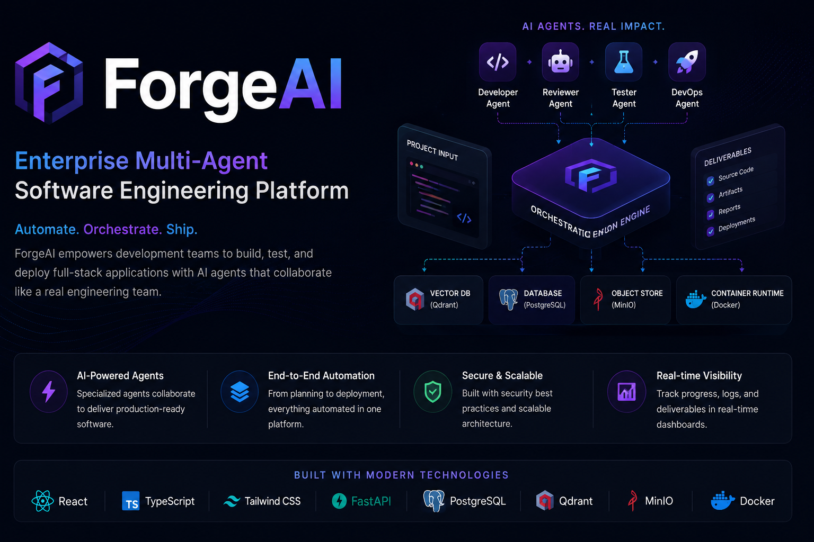
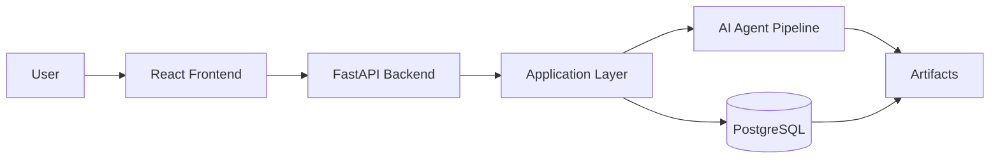

<div align="center">

# ForgeAI

### Enterprise Multi-Agent Software Engineering Platform

Transform software ideas into production-ready engineering artifacts using an AI-powered multi-agent pipeline.

<p>
  
</p>

<p>


</p>

[🚀 Live Demo](https://your-vercel-link.vercel.app)
&nbsp;&nbsp;•&nbsp;&nbsp;
[📖 API Docs](https://your-render-url.onrender.com/docs)
&nbsp;&nbsp;•&nbsp;&nbsp;
[⚙️ Backend API](https://your-render-url.onrender.com)

</div>

---

## 📑 Table of Contents

- [Overview](#-overview)
- [Why ForgeAI?](#-why-forgeai)
- [AI Multi-Agent Pipeline](#-ai-multi-agent-pipeline)
- [Features](#-features)
- [Tech Stack](#-tech-stack)
- [Architecture](#-architecture)
- [Project Structure](#-project-structure)
- [Screenshots](#-screenshots)
- [Installation](#-installation)
- [Environment Variables](#-environment-variables)
- [Deployment](#-deployment)
- [Roadmap](#-roadmap)
- [Contributing](#-contributing)
- [License](#-license)

---

# 📖 Overview

Software development begins long before writing code. Teams must analyze requirements, design system architecture, plan implementation, model databases, review outputs, and organize documentation.

ForgeAI automates this process through an intelligent multi-agent workflow. Starting from a single natural language prompt, specialized AI agents collaborate to generate structured software engineering artifacts covering every major phase of the software development lifecycle.

Built using **FastAPI**, **React**, **TypeScript**, **PostgreSQL**, and **Clean Architecture**, ForgeAI demonstrates how modern AI systems can be combined with enterprise software engineering principles to create scalable developer tooling.

---

# ✨ Why ForgeAI?

ForgeAI is more than an AI chatbot—it is an orchestrated software engineering platform where each AI agent is responsible for a dedicated engineering task.

### Highlights

- 🤖 Multi-Agent AI Orchestration
- 🏗️ Clean Architecture Backend
- 🔐 JWT Authentication & Refresh Tokens
- ⚡ Fully Asynchronous FastAPI Backend
- 🗄️ PostgreSQL (Neon) Integration
- 🎨 Modern React + TypeScript Frontend
- 📄 Artifact Preview & Download
- 📦 ZIP Artifact Packaging
- 🌐 Production Deployment on Vercel & Render
- 🐳 Dockerized Backend
- 📑 Automatic Software Documentation Generation
- 🔄 Modular & Extensible Agent Pipeline

# 🤖 AI Multi-Agent Pipeline

ForgeAI follows a collaborative **multi-agent architecture**, where each specialized AI agent is responsible for a dedicated phase of the Software Development Lifecycle (SDLC). Instead of relying on a single large language model response, the platform orchestrates multiple agents to generate structured, production-ready software engineering artifacts.

Each agent receives context from the previous stage, performs a specialized task, and passes its output to the next agent, forming an end-to-end AI-powered software engineering workflow.

---

## Pipeline Workflow

```text
                          User Project Idea
                                  │
                                  ▼
                   ┌─────────────────────────┐
                   │ Requirements Analyst    │
                   └─────────────────────────┘
                                  │
                                  ▼
                   ┌─────────────────────────┐
                   │ Software Architect      │
                   └─────────────────────────┘
                                  │
                                  ▼
                   ┌─────────────────────────┐
                   │ Task Planner            │
                   └─────────────────────────┘
                                  │
                                  ▼
                   ┌─────────────────────────┐
                   │ Database Designer       │
                   └─────────────────────────┘
                                  │
                                  ▼
                   ┌─────────────────────────┐
                   │ Backend Generator       │
                   └─────────────────────────┘
                                  │
                                  ▼
                   ┌─────────────────────────┐
                   │ Frontend Generator      │
                   └─────────────────────────┘
                                  │
                                  ▼
                   ┌─────────────────────────┐
                   │ Reviewer                │
                   └─────────────────────────┘
                                  │
                                  ▼
                   ┌─────────────────────────┐
                   │ Refiner                 │
                   └─────────────────────────┘
                                  │
                                  ▼
                   ┌─────────────────────────┐
                   │ Artifact Packager       │
                   └─────────────────────────┘
                                  │
                                  ▼
                   📦 Downloadable Engineering Artifacts
```

---

# Agent Responsibilities

| Agent | Responsibility | Generated Output |
|-------|----------------|------------------|
| 📋 Requirements Analyst | Extracts and structures functional and non-functional requirements from the user's project description. | Software Requirements Specification (SRS) |
| 🏗 Software Architect | Designs the overall system architecture, defines components, modules, and communication patterns. | High-Level Design (HLD) |
| ✅ Task Planner | Breaks the project into manageable development tasks and milestones. | Development Roadmap & Task Breakdown |
| 🗄 Database Designer | Designs database entities, relationships, normalization, and schema. | ER Diagram & Database Schema |
| ⚙ Backend Generator | Generates backend architecture, APIs, business logic, and service structure. | Backend Design Documentation |
| 🎨 Frontend Generator | Defines frontend architecture, UI structure, pages, and component hierarchy. | Frontend Design Documentation |
| 🔍 Reviewer | Reviews generated artifacts for consistency, completeness, and quality. | Review Report |
| ✨ Refiner | Improves generated artifacts by resolving inconsistencies and enhancing clarity. | Refined Documentation |
| 📦 Artifact Packager | Organizes all generated documents into downloadable artifacts. | ZIP Package & Individual Documents |

---

# Pipeline Characteristics

### Intelligent Orchestration

Each AI agent performs a specialized responsibility instead of attempting to solve the entire problem at once. This modular approach improves maintainability, scalability, and output quality.

### Context-Aware Processing

Agents consume outputs from previous stages, ensuring contextual consistency across the complete engineering workflow.

### Extensible Design

New AI agents can be introduced into the pipeline without impacting the existing architecture, allowing ForgeAI to evolve with additional engineering capabilities.

### Artifact-Based Workflow

Every stage generates reusable engineering artifacts that can be previewed, downloaded individually, or packaged into a complete project archive.

# 🚀 Features

ForgeAI combines modern AI orchestration with enterprise-grade software engineering practices to automate the early stages of software development.

---

## 🤖 AI-Powered Engineering

- Multi-Agent AI Pipeline
- Specialized AI agents for each SDLC phase
- Structured engineering artifact generation
- Context-aware sequential workflow
- Automated documentation generation
- Artifact refinement and review

---

## 💻 Modern Frontend

- React + TypeScript
- Vite for fast development
- TailwindCSS responsive UI
- Zustand state management
- Axios API integration
- Responsive dashboard
- Real-time pipeline status
- Artifact preview interface

---

## ⚙️ Enterprise Backend

- FastAPI REST API
- Async SQLAlchemy ORM
- Clean Architecture
- Dependency Injection
- Pydantic v2 validation
- Modular service layer
- Background pipeline execution
- Comprehensive error handling

---

## 🔐 Authentication & Security

- JWT Access Tokens
- Refresh Token Authentication
- Password hashing
- Protected API routes
- Role-based authorization
- Secure API communication
- Environment-based configuration

---

## 🗄️ Database

- PostgreSQL (Neon)
- SQLAlchemy Async ORM
- Alembic database migrations
- Automatic schema migrations
- Persistent project storage
- Pipeline execution history
- Artifact metadata management

---

## 📄 Artifact Management

- Artifact Preview
- Individual Downloads
- ZIP Package Download
- Persistent artifact storage
- Organized document structure

---

## 🌐 Deployment

- Frontend deployed on Vercel
- Backend deployed on Render
- Neon PostgreSQL database
- Dockerized backend
- Automatic Alembic migrations
- Production-ready configuration

  # 🛠️ Tech Stack

| Category | Technologies |
|-----------|--------------|
| **Frontend** | React, TypeScript, Vite, TailwindCSS, Zustand, Axios |
| **Backend** | FastAPI, SQLAlchemy (Async), Pydantic v2 |
| **Database** | PostgreSQL, Neon, Alembic |
| **Authentication** | JWT, Refresh Tokens |
| **AI Integration** | Grok API (OpenAI Compatible) |
| **Deployment** | Vercel, Render |
| **Containerization** | Docker |
| **Version Control** | Git, GitHub |

# 🏗️ System Architecture



## Clean Architecture

```text
Presentation Layer
        │
        ▼
Application Layer
        │
        ▼
Domain Layer
        │
        ▼
Infrastructure Layer
```

## Request Flow

```text
User

↓

React Frontend

↓

FastAPI API

↓

Authentication

↓

Application Services

↓

AI Pipeline

↓

Database

↓

Artifacts

↓

Response
```

---

# 📁 Project Structure

```text
ForgeAI
│
├── backend
│   ├── alembic
│   ├── app
│   │   ├── application
│   │   ├── domain
│   │   ├── infrastructure
│   │   └── presentation
│   ├── Dockerfile
│   └── pyproject.toml
│
├── frontend
│   ├── public
│   ├── src
│   │   ├── app
│   │   ├── components
│   │   ├── features
│   │   ├── pages
│   │   └── shared
│   └── vite.config.ts
│
├── docs
│   ├── diagrams
│   ├── gifs
│   └── images
│
└── README.md
```

---
# 📸 Screenshots

## Login

<p align="center">

</p>

---

## Dashboard

<p align="center">

</p>

---

## AI Pipeline Execution

<p align="center">

</p>

---

## Generated Artifacts

<p align="center">

</p>

---

## Artifact Preview

<p align="center">

</p>

---
# 💻 Installation

## Prerequisites

Before running ForgeAI locally, ensure the following software is installed:

- Python 3.12+
- Node.js 20+
- PostgreSQL (or Neon Database)
- Docker (optional)
- Git

---

## Clone Repository

```bash
git clone https://github.com/YOUR_USERNAME/ForgeAI.git

cd ForgeAI
```

---

## Backend Setup

```bash
cd backend

python -m venv .venv
```

### Windows

```bash
.venv\Scripts\activate
```

### Linux / macOS

```bash
source .venv/bin/activate
```

Install dependencies

```bash
pip install -e .
```

Run migrations

```bash
alembic upgrade head
```

Start backend

```bash
uvicorn app.main:app --reload
```

---

## Frontend Setup

```bash
cd frontend

npm install

npm run dev
```

---

Frontend

```
http://localhost:5173
```

Backend

```
http://localhost:8000
```

Swagger

```
http://localhost:8000/docs
```

---
# 🔑 Environment Variables

## Backend (.env)

```env
DATABASE_URL=

JWT_SECRET_KEY=

JWT_REFRESH_SECRET_KEY=

ACCESS_TOKEN_EXPIRE_MINUTES=

REFRESH_TOKEN_EXPIRE_DAYS=

GROK_API_KEY=

GROK_BASE_URL=

GROK_MODEL=
```

---

## Frontend (.env)

```env
VITE_API_BASE_URL=
```

> Never commit secrets or API keys. Use environment variables for all sensitive configuration.

---
# 🐳 Docker

Run the backend using Docker.

Build image

```bash
docker build -t forgeai-backend .
```

Run container

```bash
docker run -p 8000:8000 forgeai-backend
```

During startup, Docker automatically executes:

```bash
python -m alembic upgrade head
```

before launching the FastAPI server, ensuring the database schema is always up to date.

---
# 🚀 Deployment

ForgeAI is deployed using a modern cloud-native architecture.

| Service | Platform |
|----------|----------|
| Frontend | Vercel |
| Backend | Render |
| Database | Neon PostgreSQL |

Deployment Highlights

- Dockerized FastAPI backend
- Automatic Alembic migrations
- HTTPS-enabled services
- Production-ready environment configuration
- Secure JWT authentication
- Async PostgreSQL connectivity
- Scalable cloud deployment

---
# 📚 API Overview

| Module | Description |
|---------|-------------|
| Authentication | Login, Registration, Token Refresh |
| Projects | Create and manage projects |
| Pipeline | Execute AI workflow |
| Runs | Track pipeline executions |
| Artifacts | Preview and download generated artifacts |

Interactive API documentation is available through Swagger UI.

```
/docs
```


